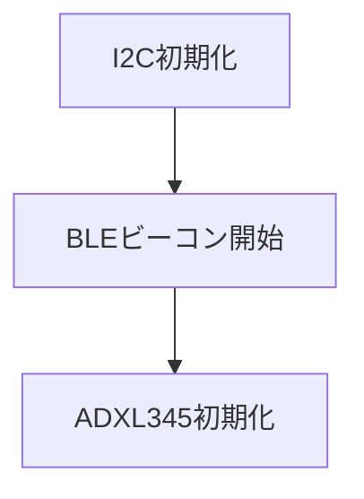
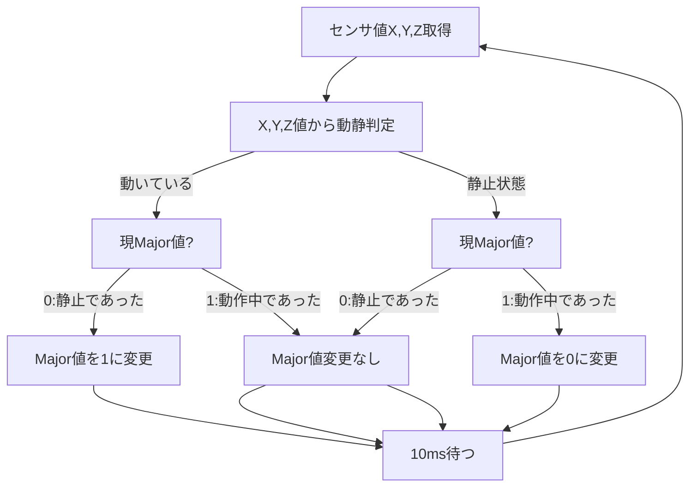

# XIAO ESP32C6と加速度センサーで動きを検知,BLEでiBeacon送信

## 仕様

Majorコード：0:静止、1:動作中

ツール：VSCode  
Framework：Arduino  
使用ライブラリ：NimBLE

対象デバイス：  

- CPU：XIAO esp32C6
- センサ：ADXL345

接続：  
VCC(3.3v)、GND、SDA、SDL端子をお互いに接続し、センサのSDO端とGNDとを接続。

## フローチャート

初期化：

  

処理ループ：

## その他

NOTE記載  

<https://note.com/yuzu_monaka_/n/n0ed9b26451bb>

<https://note.com/yuzu_monaka_/n/n42976252831a>

<https://note.com/yuzu_monaka_/n/n8208c410c1d1>

<https://note.com/yuzu_monaka_/n/n4d729d129264>
